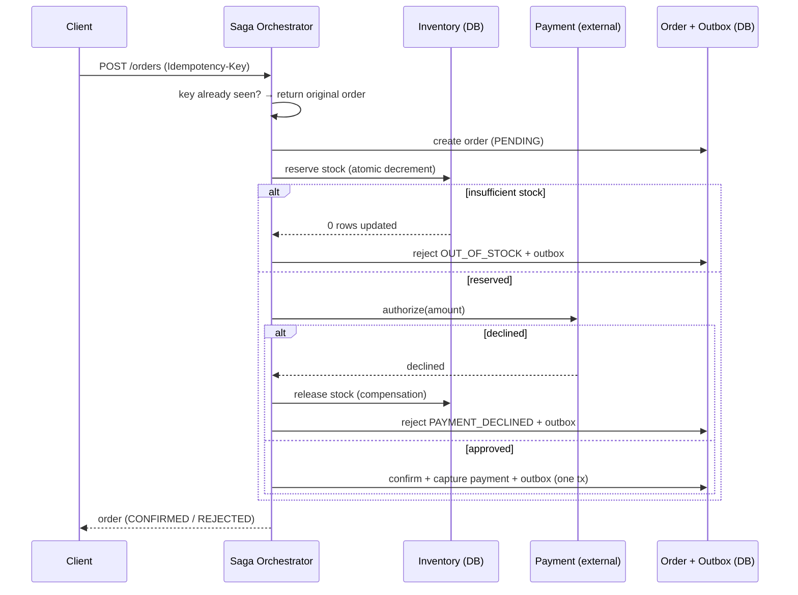

# Order & Payment

An order service built for **reliability**: it places orders across an inventory reservation and an
external payment authorization without losing money or overselling — using an orchestrated **saga**
with compensation, **idempotent** request handling, atomic stock decrements, and a **transactional
outbox**.

> **Status:** active build. Milestone 1 (saga + idempotency + outbox) is implemented and verified
> end-to-end against Postgres — including a concurrency test that proves no oversell and a Kafka relay
> that survives broker downtime. This README is honest about what runs today vs. what is roadmap.


---

## The problem

Placing an order spans steps that don't share a transaction — reserve stock, charge an external PSP,
confirm. The hard parts:

1. **Idempotency** — a client retries `POST /orders` (timeout, refresh). It must not create a second
   order or double-charge.
2. **Distributed transaction** — payment is an external call you can't roll back. If a later step
   fails, you must **compensate** (release stock, void the charge), not `ROLLBACK`.
3. **Oversell** — concurrent orders for the last unit must not both succeed.
4. **Reliable events** — "order confirmed" must reach downstream systems exactly when the order is
   actually confirmed — no lost or phantom events.

## Behaviour — verified end-to-end

Run against seeded stock (`MOUSE`=100, `LAPTOP`=10, `DESK`=5); `LAPTOP` is $1,500, the PSP declines
over $5,000.

| Scenario | Request | Outcome | Proof |
|---|---|---|---|
| Happy path | `MOUSE × 2` | `CONFIRMED`, $50 captured | stock 100 → **98** |
| Idempotent retry | same `Idempotency-Key` | **same order**, no new effects | stock stays **98** (decremented once, not twice) |
| Payment declined → compensate | `LAPTOP × 4` ($6,000) | `REJECTED` (`PAYMENT_DECLINED`) | stock reserved then **released** → net **10** |
| Oversell blocked | `DESK × 999` | `REJECTED` (`OUT_OF_STOCK`) | stock stays **5** |

Each outcome also writes an `OrderConfirmed` / `OrderRejected` row to the outbox, which the relay
publishes to a **Kafka** topic (`order-events`) — marking a row published only after the broker
acknowledges, so events parked while Kafka was down are delivered on recovery (verified).

And under real concurrency: a Testcontainers test ([`OrderConcurrencyTest`](src/test/java/com/portfolio/orderpayment/OrderConcurrencyTest.java))
fires **30 simultaneous orders** at a 5-unit product and asserts **exactly 5 confirm**, the other 25
are rejected, and stock lands at **0** — the atomic conditional decrement holds, no oversell.

## The saga



The orchestrator is **not** transactional — each step commits in its own transaction (separate
beans). That's deliberate: the external payment call sits *between* committed steps, which is exactly
why failure recovery must compensate rather than roll back. See
[ADR-0002](docs/adr/0002-saga-orchestration.md).

## How each hard problem is handled

- **Idempotency** — the `Idempotency-Key` is *claimed* (unique PK insert) before any work; a retry or
  concurrent duplicate finds the claim and returns the original order. [ADR-0001](docs/adr/0001-idempotency.md)
- **Oversell** — stock moves only via `UPDATE product SET stock = stock - :qty WHERE id = :id AND
  stock >= :qty`. The conditional makes the decrement atomic; two concurrent reservations can't both
  pass the guard.
- **Compensation** — a committed reservation followed by a declined payment triggers an explicit
  stock release.
- **Reliable events** — the outbox row is written in the **same transaction** as the state change;
  a scheduled relay publishes unpublished rows to Kafka, marking them published only after the ack.
  [ADR-0003](docs/adr/0003-transactional-outbox.md)

## Tech stack

- **Java 21**, **Spring Boot 4.1**, Spring Data JPA (Hibernate)
- **PostgreSQL** + **Flyway** migrations
- **Kafka** as the outbox event sink
- **Testcontainers** for integration tests against real Postgres
- Micrometer / Prometheus actuator metrics

## Quickstart

Requires JDK 21 (bundled Gradle wrapper) and Docker.

```bash
docker compose up -d          # Postgres + Kafka
./gradlew bootRun             # app on :8090, Flyway migrates on start
```

Place an order (idempotent — run it twice, get the same order):

```bash
curl -s localhost:8090/orders \
  -H 'Idempotency-Key: order-123' -H 'Content-Type: application/json' \
  -d '{"lines":[{"sku":"SKU-MOUSE","quantity":2}]}'
```

Trigger compensation (amount over the PSP limit → declined → stock released):

```bash
curl -s localhost:8090/orders \
  -H 'Idempotency-Key: order-456' -H 'Content-Type: application/json' \
  -d '{"lines":[{"sku":"SKU-LAPTOP","quantity":4}]}'
```

## API

| Method | Path | Notes |
|---|---|---|
| `POST` | `/orders` | Header `Idempotency-Key` required. Body `{ lines: [{ sku, quantity }] }`. Returns the order with final status. |
| `GET` | `/orders/{id}` | Fetch an order. |

## Project layout

```
src/main/java/com/portfolio/orderpayment
├── catalog/      product + atomic stock decrement
├── ordering/     order aggregate, transactional order steps
├── inventory/    reserve / release (compensation)
├── payment/      external PSP gateway (simulated)
├── idempotency/  key claim + replay lookup
├── outbox/       transactional outbox + scheduled relay
├── saga/         OrderSagaOrchestrator
└── web/          REST API + error handling
src/main/resources/db/migration   Flyway schema + seed
```

## Roadmap

- Payment **void** on the rare confirm-after-authorize failure (compensation is wired, not yet
  triggered by a failure path).
- Consumer-side dedupe example for the at-least-once Kafka stream.

## Decision records

- [ADR-0001 — Idempotent order creation](docs/adr/0001-idempotency.md)
- [ADR-0002 — Saga orchestration vs. two-phase commit](docs/adr/0002-saga-orchestration.md)
- [ADR-0003 — Transactional outbox](docs/adr/0003-transactional-outbox.md)
