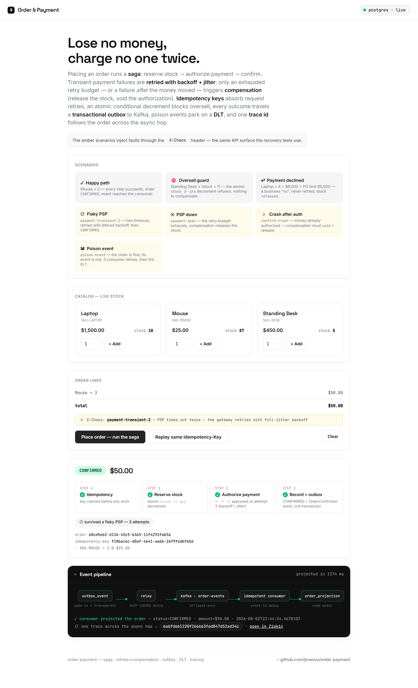
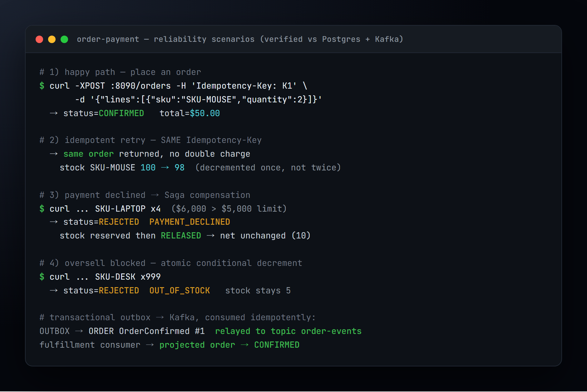
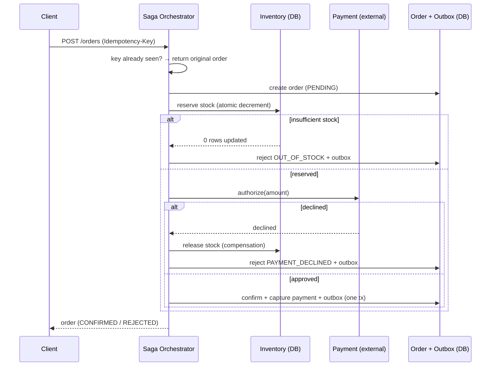

# Order & Payment

An order service built for **reliability**: it places orders across an inventory reservation and an
external payment authorization without losing money or overselling — using an orchestrated **saga**
with **hybrid recovery** (bounded retries with jitter *before* compensation), **idempotent** request
handling, atomic stock decrements, a **transactional outbox**, a **dead-letter topic** for poison
events, and **one trace id** that follows the order across the async hop.

> **Status:** Milestones 1–2 are implemented and integration-tested against real Postgres + Kafka:
> saga + idempotency + outbox, retry-then-compensate payment recovery (including the void-after-
> authorize path), consumer-side DLT parking, a multi-replica-safe relay (`SKIP LOCKED`), and W3C
> trace propagation through the outbox. Fault injection is an explicit API surface (`X-Chaos`), so
> every failure mode below is reproducible with one curl. This README is honest about what runs
> today vs. what is roadmap.


---

## Demo

Live demo UI (served from the app at `:8090`) — stage a scenario, run the saga, and watch each step
resolve: live stock from Postgres, the compensation that releases a reservation after a declined
payment, and the **event pipeline console** polling until the outbox → Kafka → idempotent-consumer
projection lands:



The four reliability scenarios, verified end-to-end against Postgres + Kafka:



## The problem

Placing an order spans steps that don't share a transaction — reserve stock, charge an external PSP,
confirm. The hard parts:

1. **Idempotency** — a client retries `POST /orders` (timeout, refresh). It must not create a second
   order or double-charge.
2. **Distributed transaction** — payment is an external call you can't roll back. If a later step
   fails, you must **compensate** (release stock, void the charge), not `ROLLBACK`.
3. **Oversell** — concurrent orders for the last unit must not both succeed.
4. **Reliable events** — "order confirmed" must reach downstream systems exactly when the order is
   actually confirmed — no lost or phantom events.

## Behaviour — verified end-to-end

Run against seeded stock (`MOUSE`=100, `LAPTOP`=10, `DESK`=5); `LAPTOP` is $1,500, the PSP declines
over $5,000.

| Scenario | Request | Outcome | Proof |
|---|---|---|---|
| Happy path | `MOUSE × 2` | `CONFIRMED`, $50 captured | stock 100 → **98** |
| Idempotent retry | same `Idempotency-Key` | **same order**, no new effects | stock stays **98** (decremented once, not twice) |
| Payment declined → compensate | `LAPTOP × 4` ($6,000) | `REJECTED` (`PAYMENT_DECLINED`) — a business "no", **never retried** | stock reserved then **released** → net **10** |
| Oversell blocked | `DESK × 999` | `REJECTED` (`OUT_OF_STOCK`) | stock stays **5** |
| Flaky PSP → retry | `X-Chaos: payment-transient:2` | `CONFIRMED` on attempt **3** (backoff + full jitter) | `paymentAttempts=3` on the order |
| PSP down → compensate | `X-Chaos: payment-down` | `REJECTED` (`PAYMENT_UNAVAILABLE`) after the retry budget | stock **released** |
| Crash after authorize | `X-Chaos: confirm-crash` | `REJECTED` (`CONFIRM_FAILED`) | authorization **voided** at the PSP **and** stock released — a DB rollback can't reach money that moved |
| Poison event → DLT | `X-Chaos: poison-event` | order `CONFIRMED`; its event fails the consumer 3× → parked on `order-events.DLT` | `GET /orders/dead-letters` shows payload + reason; the projection is never half-written |

Each outcome also writes an `OrderConfirmed` / `OrderRejected` row to the outbox, which the relay
publishes to a **Kafka** topic (`order-events`) — marking a row published only after the broker
acknowledges, so events parked while Kafka was down are delivered on recovery (verified).

All of it asserted against real infrastructure (Testcontainers Postgres + Kafka):

| Suite | What it proves |
|---|---|
| [`OrderConcurrencyTest`](src/test/java/com/portfolio/orderpayment/OrderConcurrencyTest.java) | **30 simultaneous orders** at a 5-unit product → exactly 5 confirm, stock lands at 0 — no oversell |
| [`SagaRecoveryTest`](src/test/java/com/portfolio/orderpayment/SagaRecoveryTest.java) | Transient PSP outages retry and still confirm (`paymentAttempts=3`); an exhausted budget compensates; a crash after authorization **voids + releases**; declines are never retried. Stock is asserted restored in every failure path |
| [`OutboxPipelineIT`](src/test/java/com/portfolio/orderpayment/OutboxPipelineIT.java) | Against a real broker: outbox → relay → Kafka → consumer → projection; a redelivered `event-id` is absorbed by the dedup; a poison event parks on the DLT (never half-applies); the projection carries the **original request's trace id** |

## The saga


```mermaid
sequenceDiagram
    participant C as Client
    participant O as Saga Orchestrator
    participant INV as Inventory (DB)
    participant PSP as Payment (external)
    participant DB as Order + Outbox (DB)

    C->>O: POST /orders (Idempotency-Key)
    O->>O: key already seen? → return original order
    O->>DB: create order (PENDING)
    O->>INV: reserve stock (atomic decrement)
    alt insufficient stock
        INV-->>O: 0 rows updated
        O->>DB: reject OUT_OF_STOCK + outbox
    else reserved
        O->>PSP: authorize(amount)
        alt declined
            PSP-->>O: declined
            O->>INV: release stock (compensation)
            O->>DB: reject PAYMENT_DECLINED + outbox
        else approved
            O->>DB: confirm + capture payment + outbox  (one tx)
        end
    end
    O-->>C: order (CONFIRMED / REJECTED)
```

The orchestrator is **not** transactional — each step commits in its own transaction (separate
beans). That's deliberate: the external payment call sits *between* committed steps, which is exactly
why failure recovery must compensate rather than roll back. See
[ADR-0002](docs/adr/0002-saga-orchestration.md).

## How each hard problem is handled

- **Idempotency** — the `Idempotency-Key` is *claimed* (unique PK insert) before any work; a retry or
  concurrent duplicate finds the claim and returns the original order. [ADR-0001](docs/adr/0001-idempotency.md)
- **Oversell** — stock moves only via `UPDATE product SET stock = stock - :qty WHERE id = :id AND
  stock >= :qty`. The conditional makes the decrement atomic; two concurrent reservations can't both
  pass the guard.
- **Hybrid recovery** — transient PSP failures get bounded retries with exponential backoff and
  **full jitter** (de-correlating the retry storms that turn blips into metastable failures);
  declines are a business answer and are never retried; only an exhausted budget — or a failure
  *after* the money moved (→ **void** + release) — compensates. [ADR-0004](docs/adr/0004-hybrid-recovery.md)
- **Reliable events** — the outbox row is written in the **same transaction** as the state change;
  a scheduled relay claims batches with `FOR UPDATE SKIP LOCKED` (safe at `replicas > 1`) and marks
  rows published only after the broker ack. [ADR-0003](docs/adr/0003-transactional-outbox.md)
- **Idempotent consumption** — the `order-events` consumer builds a read-model projection and records
  each processed event id in a ledger, so an at-least-once redelivery is processed exactly once
  (asserted by replaying a duplicate record in `OutboxPipelineIT`).
- **Poison events** — a record that keeps failing is retried 3× with backoff, then parked on
  `order-events.DLT` and drained into a queryable table — parking beats blocking the partition or
  silent dropping. [ADR-0005](docs/adr/0005-dead-letter-topic.md)
- **Tracing across the async hop** — the producing request's W3C `traceparent` is persisted **in the
  outbox row**, restored onto the Kafka record, and joined by the consumer: one trace from
  `POST /orders` to the projection, visible in Zipkin, with the trace id returned by the
  fulfillment endpoint. [ADR-0006](docs/adr/0006-tracing-across-the-outbox.md)

## Tech stack

- **Java 21**, **Spring Boot 4.1**, Spring Data JPA (Hibernate)
- **PostgreSQL** + **Flyway** migrations
- **Kafka** as the outbox event sink (+ `order-events.DLT`)
- **Micrometer Tracing** (Brave) + **Zipkin** — one trace across the async boundary
- **Testcontainers** for integration tests against real Postgres **and Kafka**
- Micrometer / Prometheus metrics — saga outcomes, payment retries, DLT count

## Quickstart

Requires JDK 21 (bundled Gradle wrapper) and Docker.

```bash
docker compose up -d          # Postgres + Kafka + Zipkin (:9411)
./gradlew bootRun             # app on :8090, Flyway migrates on start
```

Or build and run the app itself as a container (it connects to the compose Postgres/Kafka):

```bash
docker build -t order-payment .
docker run --rm -p 8090:8090 \
  -e DB_URL=jdbc:postgresql://host.docker.internal:5432/orderpayment \
  -e KAFKA_BOOTSTRAP=host.docker.internal:9092 order-payment
```

Place an order (idempotent — run it twice, get the same order):

```bash
curl -s localhost:8090/orders \
  -H 'Idempotency-Key: order-123' -H 'Content-Type: application/json' \
  -d '{"lines":[{"sku":"SKU-MOUSE","quantity":2}]}'
```

Trigger compensation (amount over the PSP limit → declined → stock released):

```bash
curl -s localhost:8090/orders \
  -H 'Idempotency-Key: order-456' -H 'Content-Type: application/json' \
  -d '{"lines":[{"sku":"SKU-LAPTOP","quantity":4}]}'
```

Inject faults through the same API surface the recovery tests use (`X-Chaos`, gated by
`chaos.enabled`):

```bash
# PSP times out twice → retried with jittered backoff → CONFIRMED with paymentAttempts=3
curl -s localhost:8090/orders -H 'Idempotency-Key: chaos-1' -H 'X-Chaos: payment-transient:2' \
  -H 'Content-Type: application/json' -d '{"lines":[{"sku":"SKU-MOUSE","quantity":2}]}'

# crash after the money was authorized → compensation VOIDS the authorization + releases stock
curl -s localhost:8090/orders -H 'Idempotency-Key: chaos-2' -H 'X-Chaos: confirm-crash' \
  -H 'Content-Type: application/json' -d '{"lines":[{"sku":"SKU-MOUSE","quantity":2}]}'

# order confirms, but its event is corrupted → 3 consumer retries → order-events.DLT
curl -s localhost:8090/orders -H 'Idempotency-Key: chaos-3' -H 'X-Chaos: poison-event' \
  -H 'Content-Type: application/json' -d '{"lines":[{"sku":"SKU-MOUSE","quantity":1}]}'
curl -s localhost:8090/orders/dead-letters
```

## API

| Method | Path | Notes |
|---|---|---|
| `POST` | `/orders` | Header `Idempotency-Key` required; optional `X-Chaos` fault directive. Body `{ lines: [{ sku, quantity }] }`. Returns the order with final status + `paymentAttempts`. |
| `GET` | `/orders/{id}` | Fetch an order. |
| `GET` | `/orders/{id}/fulfillment` | Consumer-side read model. 404 until the event has travelled outbox → Kafka → consumer, so a poll observes the pipeline end to end. Returns the **original request's `traceId`**. |
| `GET` | `/orders/dead-letters` | Poison events parked off `order-events.DLT` — payload + failure reason, newest first. |
| `GET` | `/products` | Catalog with live stock — watch reservations and compensations move real inventory. |

## Project layout

```
src/main/java/com/portfolio/orderpayment
├── catalog/      product + atomic stock decrement
├── ordering/     order aggregate, transactional order steps
├── inventory/    reserve / release (compensation)
├── payment/      simulated PSP + retry decorator (backoff + full jitter)
├── idempotency/  key claim + replay lookup
├── outbox/       transactional outbox (traceparent capture) + SKIP LOCKED relay
├── fulfillment/  Kafka consumer → idempotent projection · DLT consumer + parked events
├── chaos/        explicit fault-injection surface (X-Chaos)
├── saga/         OrderSagaOrchestrator — hybrid recovery
└── web/          REST API + error handling
src/main/resources/db/migration   Flyway schema + seed
```

## Roadmap

- Manual re-drive tooling for parked DLT events (parking is terminal by design today).
- PSP-level idempotency keys on the authorize call for a real gateway integration.

## Decision records

- [ADR-0001 — Idempotent order creation](docs/adr/0001-idempotency.md)
- [ADR-0002 — Saga orchestration vs. two-phase commit](docs/adr/0002-saga-orchestration.md)
- [ADR-0003 — Transactional outbox](docs/adr/0003-transactional-outbox.md)
- [ADR-0004 — Hybrid recovery: retries with jitter, then compensation](docs/adr/0004-hybrid-recovery.md)
- [ADR-0005 — Poison events park on a dead-letter topic](docs/adr/0005-dead-letter-topic.md)
- [ADR-0006 — One trace across the async boundary](docs/adr/0006-tracing-across-the-outbox.md)
